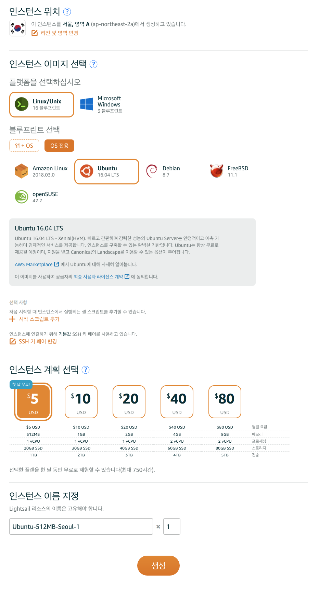
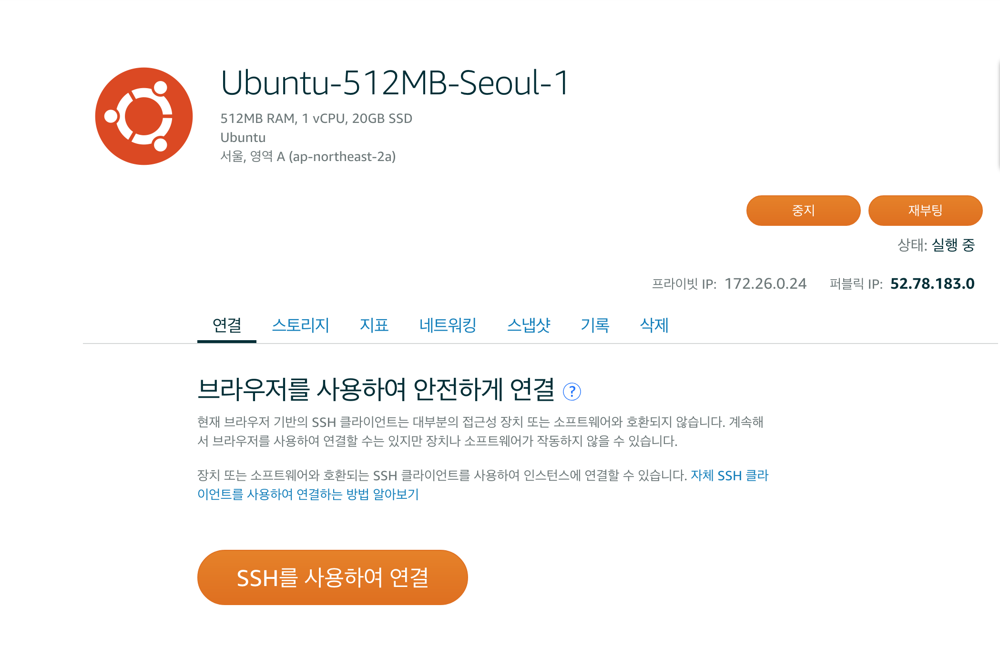

# How to deploy to aws

## AWS EC2에 배포하기
> EC2의 경우 **프리티어** 기준으로 `t2.micro` 인스턴스 하나를 무료로 쓸 수 있다. 
> 실제로 활용하지 않을 경우 반드시 인스턴스 삭제를 할 것!
> EC2 배포과정에서 ssh 접속이 필요한데 포트 문제로 해당 과정은 LightSail로 대체.
> 나머지는 동일하나 ssh 접속과 관련하여 윈도우는 putty를 설치하여야 하며, mac은 추가 설치는 필요없다.

## [AWS LightSail](https://aws.amazon.com/ko/lightsail/?nc2=h_m1) 활용하기
> port 문제로 Lightsail을 활용하는 법을 통하여(웹 상에서 ssh 접근 가능) 실습을 하도록 하며, 첫달 무료 이후는 과금되므로 유의한다.
> 반드시 [가격 정책](https://aws.amazon.com/ko/lightsail/pricing/) 확인!

### 1. 본인 프로젝트 Github에 업로드

### 2. Lightsail 서버 
**서울 리전으로 진행**

#### 2.1. 기본 설정 
> ssh 우측하단에 있는 메모장 같은 버튼 클릭하고, 내용 붙여넣고 터미널 화면에 우클릭하면 복사 붙여넣기가 가능함.
> 한글은 기본적으로 지원하지 않음. 

##### 2.1.1. 기본 설정(아래의 사진 참고)

##### 2.1.2. 콘솔 접속(아래의 사진 참고)

#### 2.2. 프로젝트 가져오기
본인의 프로젝트를 해당 인스턴스로 옮긴다.

```console
 $ cd ~
 $ git clon url
```
#### 2.3. AWS 서버 환경 설정
##### 2.3.1. Ubuntu 및 Ruby 환경 설정 진행
> LightSail에서 복사 붙여넣기가 불편한 관계로 shell script로 진행하며, 명령어 설명은 따로 진행한다.
> Vagrant 환경에서 진행한 것과 동일하게 ruby 버전을 관리할 수 있는 rbenv와 이와 관련된 기본 프로그램을 설치하는 것.

shell script는 [zzulu github](https://github.com/zzulu/yay-you-are-on-aws.git)에서 제공
```
$ git clone https://github.com/zzulu/yay-you-are-on-aws.git
$ cd ~/yay-you-are-on-aws
$ sh ./scripts/rbenv.sh
```
**아래의 명령어는 상단의 shell script를 활용하여 설치되므로 입력하지 말것**
```
# ./rbenv.sh
cd ~

# Install some dependencies for Ruby
sudo apt-get update
curl -sL https://deb.nodesource.com/setup_8.x | sudo -E bash -
curl -sS https://dl.yarnpkg.com/debian/pubkey.gpg | sudo apt-key add -
echo "deb https://dl.yarnpkg.com/debian/ stable main" | sudo tee /etc/apt/sources.list.d/yarn.list

sudo apt-get update
sudo apt-get -y install git-core curl zlib1g-dev build-essential libssl-dev libreadline-dev libyaml-dev libsqlite3-dev sqlite3 libxml2-dev libxslt1-dev libcurl4-openssl-dev python-software-properties libffi-dev nodejs yarn imagemagick 

# mysql일 경우 설치해야함.
sudo apt-get -y install mysql-client libmysqlclient-dev

# Install rbenv and ruby-build plugins
cd ~
git clone https://github.com/rbenv/rbenv.git ~/.rbenv
echo 'export PATH="$HOME/.rbenv/bin:$PATH"' >> ~/.bashrc
echo 'eval "$(rbenv init -)"' >> ~/.bashrc

git clone https://github.com/rbenv/ruby-build.git ~/.rbenv/plugins/ruby-build
echo 'export PATH="$HOME/.rbenv/plugins/ruby-build/bin:$PATH"' >> ~/.bashrc

# Disable gem document installation 
echo 'gem: --no-document' > ~/.gemrc
```

##### 2.3.2. shell 새로고침
shell 변경사항을 반경하기 위해 shell을 새로고침 
```
$ exec $SHELL
```

##### 2.3.3. Ruby 설치 및 bundler 설치
앞선 `2.2.2.`에서 설치한 rbenv를 통해 ruby를 설치한다.
```
$ rbenv install 2.3.5
$ rbenv global 2.3.5
$ gem install bundler
$ rbenv rehash
```

##### 2.3.4. Rails 설치
```
gem install rails -v 4.2.10
```


#### 2.4. Nginx, Passenger 설치
> 우리가 개발환경에서는 rails 버전마다 다르지만 서버를 구동하기 위해 (4.x. : webrick 5.x. : puma)를 사용하였다. 
> 다만, 실제 배포 환경에서는 아파치(apache)나 Nginx를 활용하게 되는데 우리는 Nginx를 활용하여 서버를 구축할 것이다.
> 메모리와 성능이 좋고 아파치에 대해 경령화되어 있으며, 2000년대 초 이후로 급성장하였다.
> Nginx는 서버에 요청을 보내는 리버스 프록시로서의 역할을 하고, HTTP 서버로서의 역할을 하게 된다. 
> `Passenger`는 rails 어플리케이션을 nginx로 배포하도록 도와주는 작업을 진행한다. 

##### 2.4.1 Ngnix 설치
설치를 위해 쉘 스크립트를 실행
```
$ sh ./scripts/nginx.sh
```
**아래의 명령어는 상단의 shell script를 활용하여 설치되므로 입력하지 말것**

```
#!/bin/bash
set -e

# APT-GET Update
sudo apt-key adv --keyserver hkp://keyserver.ubuntu.com:80 --recv-keys 561F9B9CAC40B2F7
sudo apt-get install -y apt-transport-https ca-certificates

# Add Passenger APT repository
sudo sh -c 'echo deb https://oss-binaries.phusionpassenger.com/apt/passenger xenial main > /etc/apt/sources.list.d/passenger.list'
sudo apt-get update

# Install Passenger & Nginx
sudo apt-get install -y nginx-extras passenger
```

##### 2.4.2. Ngninx 설정하기
##### 1) passenger 설정파일 열어 수정하기
``` 
$ sudo vi /etc/nginx/passenger.conf
```
```
passenger_ruby /home/ubuntu/.rbenv/shims/ruby;
```

##### 2) nginx 설정파일 열어 수정하기
```
$ sudo vi /etc/nginx/nginx.conf
```
아래의 코드를 찾아서 주석해제
```
include /etc/nginx/passenger.conf;
```
* tip: vim에서 `set nu`를 통해 라인 수를 확인하면, 63번째 줄에 있다. 

##### 3) nginx 추가 설정 수정
```
$ sudo vi /etc/nginx/sites-enabled/default
```
아래의 부분을 찾아서 설정
```
server {
        listen 80;
        listen [::]:80 ipv6only=on;


        # Add index.php to the list if you are using PHP
        # index index.html index.htm index.nginx-debian.html;

        server_name         example.com;
        passenger_enabled   on;
        rails_env           production;
        root                /home/ubuntu/fake_insta/public; #반드시 아래 주의 사항 확인!!!!!!!!!!~

        ## Comment the following block
        # location / {
        #   # First attempt to serve request as file, then
        #   # as directory, then fall back to displaying a 404.
        #   try_files $uri $uri/ =404;
        # }
}
```

* tip: 36, 39번째 줄 주석처리하면서 확인. 43-47줄 주석. (라인 다를 수 있음 주의.)
* **root 경로는 /home/ubuntu/_내프로젝트명_/public**

##### 4) 테스트 및 서버 실행

설정 파일 편집이 완료되었으면 작성이 잘 되었는지 테스트하기 위하여 아래의 명령어를 입력한다.
```
$ sudo nginx -t
```
만약 문제가 없다면, 아래의 명령어를 입력하여 Nginx 서버 실행
```
$ sudo service nginx start
```
아래의 코드로 종료
```
$ sudo service nginx stop
```
##### 2.5.1. Rails 프로젝트 설정

가져온 프로젝트 폴더 안으로 이동한다.

```console
$ cd ~
$ cd fake_insta
```

gem 파일들을 설치한다.

```console
$ bundle install
```

`secrets.yml` 파일을 열어보면 production 부분에 secret_key_base가 설정되어 있지 않다. 
노출되면 안되는 중요한 정보이기 때문에 Rails가 자동으로 생성하지 않아서 figaro를 이용하여 직접 설정해주어야 한다.
figaro를 설치한다.

```console
$ bundle exec figaro install
```

128자리 난수를 생성하여 `config` 폴더 안의 `application.yml` 파일에 붙여넣는다.

```console
$ rake secret >> ./config/application.yml
```

`application.yml` 파일을 열어, 128자리 난수 앞에 아래의 코드를 작성하고, 기존 프로젝트 로컬에서 설정한 환경 변수 중 필요한 내용들을 가져온다.

```console
$ vi ./config/application.yml
```

```yaml
production: 
  SECRET_KEY_BASE: (방금 생성한 128자리 난수)
  FB_APP_KEY: ..
  ..
```
* application.yml 라인 반드시 주의할 것!!space 2칸으로 맞추는 것 추천.
* 본인 로컬 환경에 있던 내용들 복붙

`production` 환경으로 Database를 생성한다.

```console
$ RAILS_ENV=production rake db:migrate
```

production 환경에서는 precompile된 assets들을 사용하기 때문에 precompile된 파일들을 따로 생성해주어야 한다. 아래의 명령어로 생성을 한다.
자세한 내용은 레일즈 가이드 aseet-pipeline 참고

```console
$ RAILS_ENV=production rake assets:precompile
```

아래의 명령어로 프로젝트를 refresh 한다.

```console
$ touch tmp/restart.txt
```

nginx가 켜져있는지 확인하고, Lightsail의 IP 주소를 브라우저 주소창에 입력하여 사이트에 접속이 되는지 확인한다.
```
$ sudo service nginx start 
```

## [AWS RDS](https://aws.amazon.com/ko/rds/?nc2=h_m1) 설정
> DB 서버를 따로 분리하고 싶은 경우 RDS를 활용할 수 있다. 
> RDS 역시도 EC2 인스턴스를 기반으로 운영되고 있으나, 데이터베이스 인프라를 관리하고 유지보수에 용이하게 끔 지원하는 PaaS
> RDS 인스턴스 요금은 기본 인스턴스 크기, 데이터 스토리지, 멀티 가용영역, 데이터 전송에 따라 달라지므로 도입 이전에 고민해봐야함.
> EC2(혹은 LightSail)에 직접 설치 하거나 RDS를 활용하는 방안 두 가지가 있을 수 있는데, 
> 빠른 시간내에 구축가능하며, 설치/업데이트 등 관리를 포함한 유지보수가 용이하다는 장점이 있다. 또한 백업과 복구 역시도 AWS 콘솔에서 진행 가능하다. 
> 또한 클라우드 서비스의 특성상 인스턴스 축소 및 확장 등이 쉽다. 
> 다만, 비용 체계가 복잡하고 유지하는 것만으로도 돈이 나가기 때문에 반드시 고민해보자.(는 그냥 쓰자)

### 0. aws 서버에 mysql 설치
앞선 설치 과정에서 mysql-server는 설치가 되지 않았으므로, 설치
```
$ sudo apt-get -y install mysql-server
```
----
### 1. DB 생성(AWS RDS 콘솔)
**서울 리전으로 진행**
#### 1.1. Crete Database

#### 1.2. MySQL 선택

#### 1.3. DB 세부정보 지정

#### 1.3.1. 인스턴스 사양(그대로)
  - DB 인스턴스 클래스 db.t2.micro(확인)

#### 1.3.2. 설정 
  - DB 인스턴스 식별자 : 프로젝트명으로 _fakeinsta_
  - 마스터 사용자 이름 : admin (변경가능, 추천)
  - 마스터 암호 : 암호 8자 이상

#### 1.4. 고급 설정 구성

##### 1.4.1. 네트워크 및 보안
  - VPC : Default VPC (vpc-2ca90b45) (그대로) 
  - Subnet Group : default (그대로) 
  - 퍼블릭 액세스 가능성 : 예 (그대로) 
  - 가용 영역 : 기본 설정 없음 (그대로) 
  - VPC Security Group(s) : Create new Security Group (처음에는)

##### 1.4.2. 데이터베이스 옵션
  - 데이터베이스 이름 : 공백 (그대로) 
  - 데이터베이스 포트 : 3306 (그대로) 
  - DB 파라미터 그룹 : default mysql5.6 (그대로) 
  - Option Group : default mysql-5-6 (그대로)
  - IAM DB 인증 사용 : 비활성화(그대로)
  - 
##### 1.4.3. 백업
  - 백업 보존 기간 : 7 days (그대로) 
  - 백업 기간 : 기본 설정 없음 (그대로)

###### 1.4.4. 모니터링
  - 확장 모니터링 : 사용 안 함(그대로) 
  - 
###### 1.4.5. 로그 내보내기(그대로)

###### 1.4.6. 유지 관리 (그대로)
  - 자동 마이너 버전 업그래이드 사용
  - 유지관리 기간 : 기본 설정 없음
----

#### 2. 파라미터 그룹 설정(UTF-8)/(AWS RDS 콘솔)
##### 2.1. 파라미터 그룹 생성
  - 파라미터 그룹 패밀리 : mysql5.6
  - 그룹 이름 : mysql5.6_utf8
  - 설명 : utf8 옵션 설정
##### 2.2. 파라미터 편집
  - `char`로 검색하여, `character_set_client` `character_set_conntection` `character_set_database` `character_set_filesystem` `character_set_results` `character_set_server` 모두 utf8
  - `collation`으로 검색하여 `collation_connection` `collation_server` 모두 `utf8_unicode_ci`
  - 
##### 2.3. 변경사항 저장
##### 2.4. 해당 인스턴트로가서 세부정보 수정하여 파라미터 그룹 변경 및 재부팅

#### 3. Lightsail - RDS VPC 보안 그룹 설정(AWS EC2 콘솔 및 Lightsail 콘솔)

##### 3.1.1. 보안 그룹(EC2대시보드 왼쪽)
##### 3.1.2. 인바운드 > 편집 > 추가 > MYSQL/Aurora, TCP, 3306, 사용자 지정(_lightsail public ip_/32) 저장
##### 3.2.1. Lightsail 설정 > 네트워킹 > IP주소 > 방화벽 > 다른 항목 추가 > MySQL/Aurora


#### 4. 코드 수정

##### 4.1. Gemfile
```ruby
group :development, :test do 
  gem 'sqlite3'
end
group :production do
  gem 'mysql2', `~> 0.3.21'
end
```
##### 4.2. config/database.yml
```yaml
production:
  adapter: mysql2
  encoding: utf8
  database: 프로젝트명
  username: <%= ENV["RDS_USERNAME"] %>
  password: <%= ENV["RDS_PASSWORD"] %>
  host: <%= ENV["RDS_HOSTNAME"] %>
  port: 3306
  pool: 5
  timeout: 5000
```

##### 4.3. config/application.yml
```yaml
  RDS_USERNAME: 사용자 이름
  RDS_PASSWORD: 설정한 비밀번호
  RDS_HOSTNAME: 앤드포인트
```
##### 4.4. mysql 접속
원격으로 접속이 가능한지 확인한다. 접속되면 exit로 나간다.
```
$ mysql -h HOSTNAME(endpoint주소) -P 3306 -u RDSUsername(예-admin) -p
password:
mysql> exit
```

##### 4.5. 프로젝트 반영
변경 이후 push 후 git pull origin master
application.yml 환경 변수 추가
기존의 DB TABLE을 없애고 새로 만들어 변경된 사항들을 적용한다.
```
$ sudo service nginx stop
$ bundle install
$ RAILS_ENV=production rake db:drop
$ RAILS_ENV=production rake db:create
$ RAILS_ENV=production rake db:migrate
$ touch tmp/restart.txt
$ sudo service nginx start
```